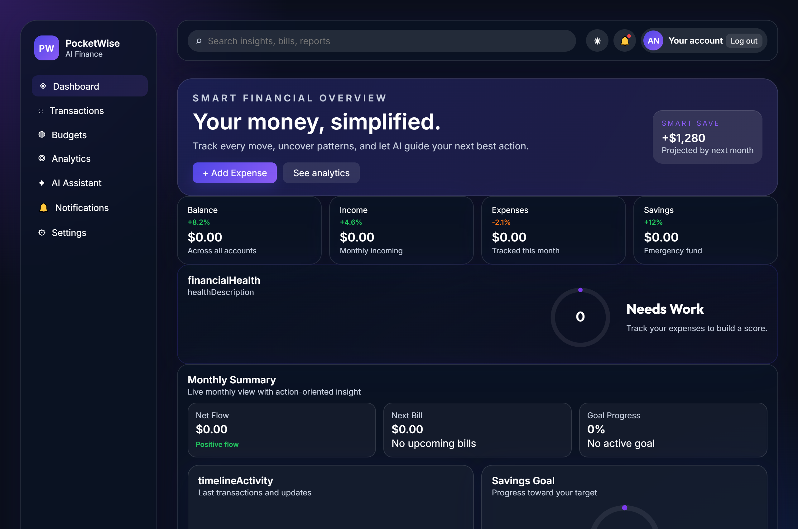
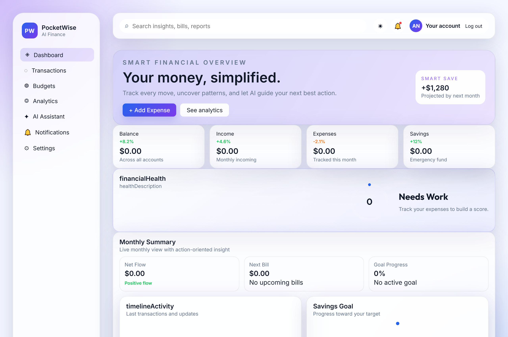
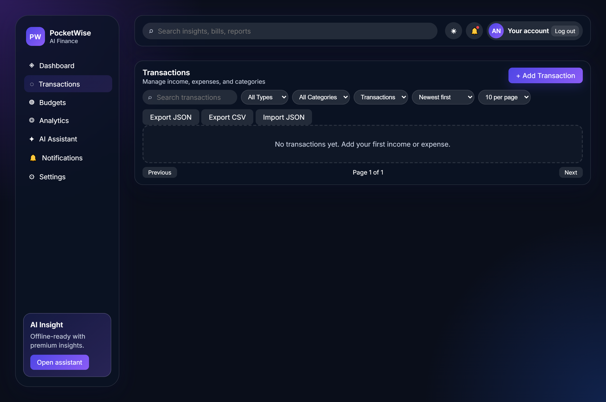
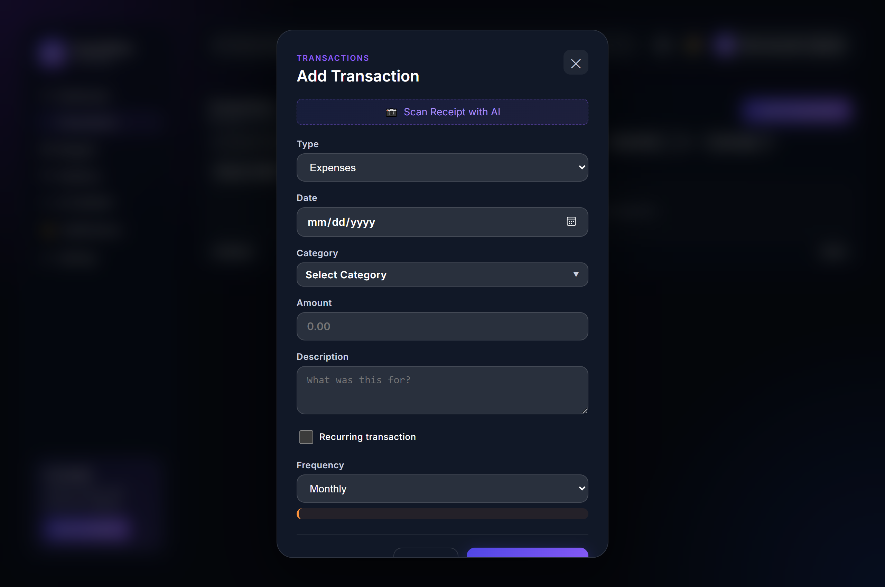
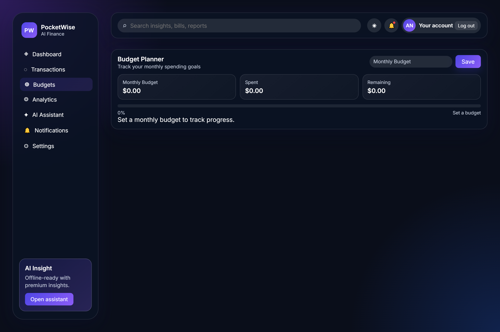
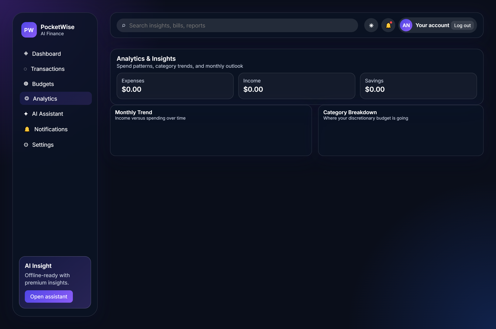
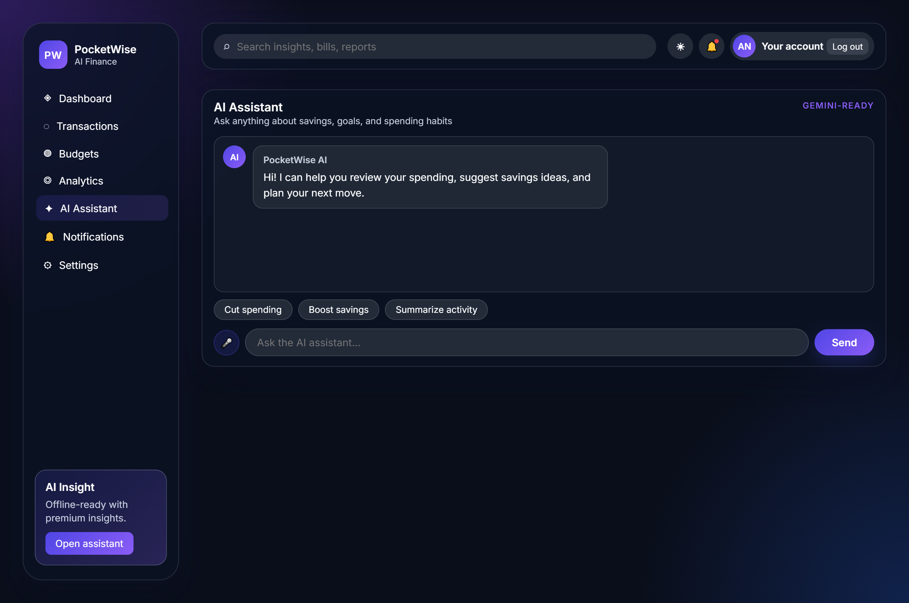
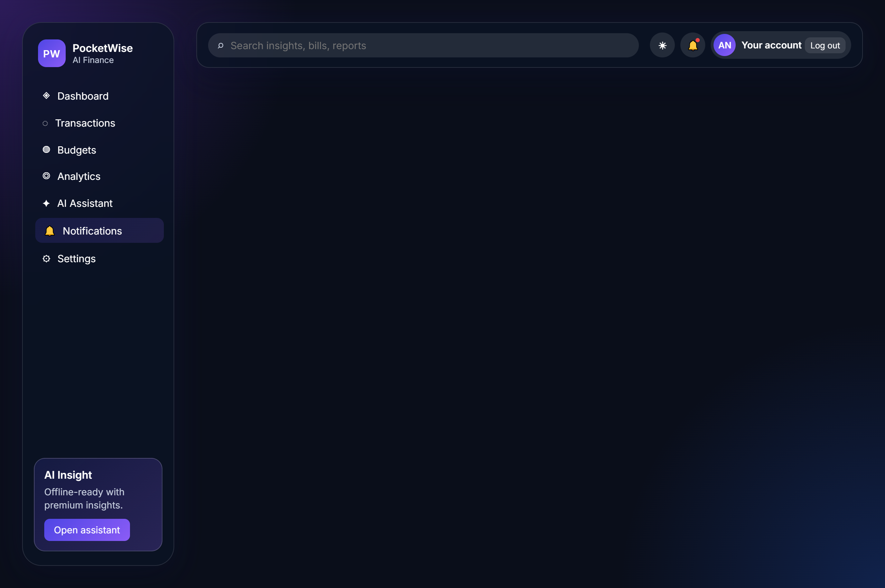
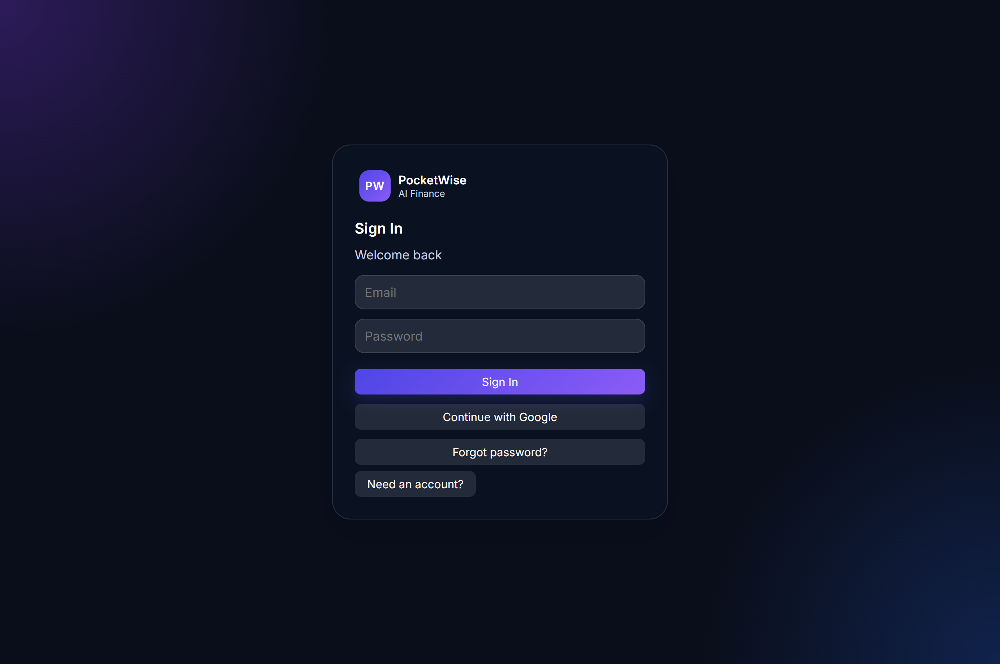
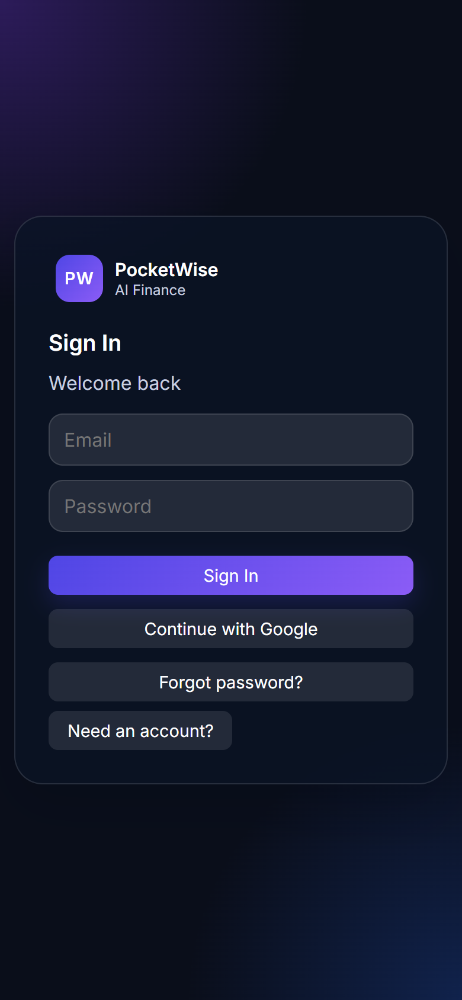

# 💳 PocketWise | AI Personal Finance & Expense Intelligence Dashboard

> **Your Money, Simplified.** Track every move, uncover financial patterns, and let AI guide your next best financial decision.

<p align="center">
  
</p>

<p align="center">
  <a href="https://pocketwise.ox0x.com">
    
  </a>
  <a href="https://pocketwise.ox0x.com">
    
  </a>
  <a href="https://pocketwise.ox0x.com">
    
  </a>
  
</p>

---

## 🌟 Overview

**PocketWise** is a state-of-the-art, progressive web application (PWA) designed for modern personal finance tracking, intelligent budgeting, and AI-driven financial insights. Powered by Google Gemini AI, Chart.js, and modern Glassmorphism UI architecture, PocketWise offers a seamless interface across mobile, tablet, and desktop devices.

---

## 📸 Screenshots & Interface Walkthrough

<div align="center">

### 🌙 Dark & ☀️ Light Dashboard Modes
<table>
  <tr>
    <td width="50%" align="center"><b>Dark Mode Dashboard</b></td>
    <td width="50%" align="center"><b>Light Mode Dashboard</b></td>
  </tr>
  <tr>
    <td></td>
    <td></td>
  </tr>
</table>

### 💳 Transaction Management & AI Receipt Scanner
<table>
  <tr>
    <td width="50%" align="center"><b>Transactions Ledger & Filters</b></td>
    <td width="50%" align="center"><b>Add Expense & AI Scanner Modal</b></td>
  </tr>
  <tr>
    <td></td>
    <td></td>
  </tr>
</table>

### 🎯 Budget Planner & 📈 Financial Analytics
<table>
  <tr>
    <td width="50%" align="center"><b>Monthly Budget Planner</b></td>
    <td width="50%" align="center"><b>Interactive Analytics & Trends</b></td>
  </tr>
  <tr>
    <td></td>
    <td></td>
  </tr>
</table>

### ✦ AI Assistant & 📅 Notifications Calendar
<table>
  <tr>
    <td width="50%" align="center"><b>Gemini AI Financial Assistant</b></td>
    <td width="50%" align="center"><b>Notifications & Bills Calendar</b></td>
  </tr>
  <tr>
    <td></td>
    <td></td>
  </tr>
</table>

### 🔐 Authentication & 📱 Mobile Responsiveness
<table>
  <tr>
    <td width="50%" align="center"><b>Authentication Screen</b></td>
    <td width="50%" align="center"><b>Mobile Responsive View</b></td>
  </tr>
  <tr>
    <td></td>
    <td></td>
  </tr>
</table>

</div>

---

## ✨ Key Features

### 📊 1. Smart Dashboard & Financial Health Score
- **Real-Time Financial Metrics**: Instant updates for Total Balance, Monthly Income, Expenses, and Net Savings with trend indicators.
- **Dynamic Financial Health Score (0-100)**: Evaluates cash flow stability, savings rates, and budget adherence using interactive SVG charts.
- **Goal & Bill Widgets**: Track progress on savings targets and upcoming bill obligations at a glance.
- **Activity Timeline**: Live feed of recent transaction activities.

### 💳 2. Comprehensive Transaction Management
- **Full CRUD Operations**: Easily add, edit, filter, and delete transactions.
- **Smart Filtering & Search**: Instant lookup by transaction name, type (Income/Expense), category, or custom search scope.
- **Recurring Expenses**: Schedule weekly, monthly, or yearly recurring payments.
- **AI Receipt Scanner**: Extract itemized expense details automatically from physical receipt photos or PDFs.
- **Data Export & Import**: Full support for exporting and importing data in both **JSON** and **CSV** formats, plus downloadable **PDF reports**.

### 🎯 3. Budget Planner & Goal Tracker
- **Monthly Budget Targets**: Set spending caps and monitor live remaining budget percentage.
- **Alert & Threshold System**: Visual warnings when spending reaches 80% or exceeds set monthly limits.
- **Interactive Savings Goals**: Set target deadlines and watch progress update dynamically.

### 📈 4. Advanced Analytics & Visualizations
- **Interactive Line Charts**: Track income vs. spending trends over time.
- **Category Breakdown Charts**: Visual representation of discretionary budget allocation.
- **Powered by Chart.js 4**: High-performance interactive visualizations.

### ✦ 5. AI Financial Assistant & Voice Input
- **Gemini-Powered Chatbot**: Instant contextual advice on spending cuts, budget optimizations, and savings strategies.
- **One-Click Quick Actions**: Quick prompts like *"Cut spending by 15%"*, *"Boost savings"*, and *"Summarize activity"*.
- **Voice Input**: Tap to speak financial queries directly to the assistant.

### 🔔 6. Calendar & Smart Notifications
- **Visual Month Calendar**: View upcoming bills, payment due dates, and transaction history on an interactive calendar grid.
- **Notifications Center**: Instant alerts for large expenses, upcoming bill reminders, and potential recurring subscription detections.

### ⚙️ 7. Customization & Offline PWA Capabilities
- **Dark & Light Mode**: Seamless theme switching with glassmorphism visual aesthetics.
- **Multi-Language & RTL Support**: Built-in support for **English**, **Arabic (العربية)** with native RTL layout, and **Spanish (Español)**.
- **Offline PWA Support**: Installable on mobile & desktop with offline-first service worker cache.
- **Command Palette (`Cmd / Ctrl + K`)**: Keyboard-driven quick navigation and command execution.

---

## 🛠️ Technology Stack

| Component | Technology / Library |
| :--- | :--- |
| **Frontend Core** | HTML5, JavaScript (ES6+ Modules), Vanilla CSS3 (Glassmorphism design system) |
| **Typography** | Google Fonts (*Outfit*, *Inter*) |
| **Data Visualization** | Chart.js 4.4, Marked.js |
| **Backend & Auth** | Firebase Authentication, Cloud Firestore |
| **AI Integration** | Google Gemini API (Serverless REST API) |
| **PWA & Offline** | Web Application Manifest, Service Worker |
| **PDF Generation** | jsPDF, AutoTable |

---

## 🚀 Quick Start & Installation

### Option 1: Live Web App (No Installation Needed)
Access the live version directly at: [https://pocketwise.ox0x.com](https://pocketwise.ox0x.com)

### Option 2: Local Development Setup

1. **Clone the Repository**
   ```bash
   git clone https://github.com/your-username/pocketwise.git
   cd pocketwise
   ```

2. **Serve Files Locally**
   You can use any static server, such as `live-server` or `serve`:
   ```bash
   npx serve .
   ```

3. **Open in Browser**
   Navigate to `http://localhost:3000` or the port displayed in your terminal.

---

## 🔒 Security & Data Privacy

- **Client-Side Privacy**: All sensitive transaction calculations are executed locally in the browser.
- **Firebase Auth & Firestore Rules**: User data is isolated per authenticated account using strict security rules.
- **Local Fallback**: Data is cached in `localStorage` for offline access and instant loading.

---

## 📄 License

This project is licensed under the **MIT License** - see the [LICENSE](LICENSE) file for details.

---

<p align="center">
  Made with ❤️ by the PocketWise Team | Live Web App: <a href="https://pocketwise.ox0x.com">pocketwise.ox0x.com</a>
</p>
