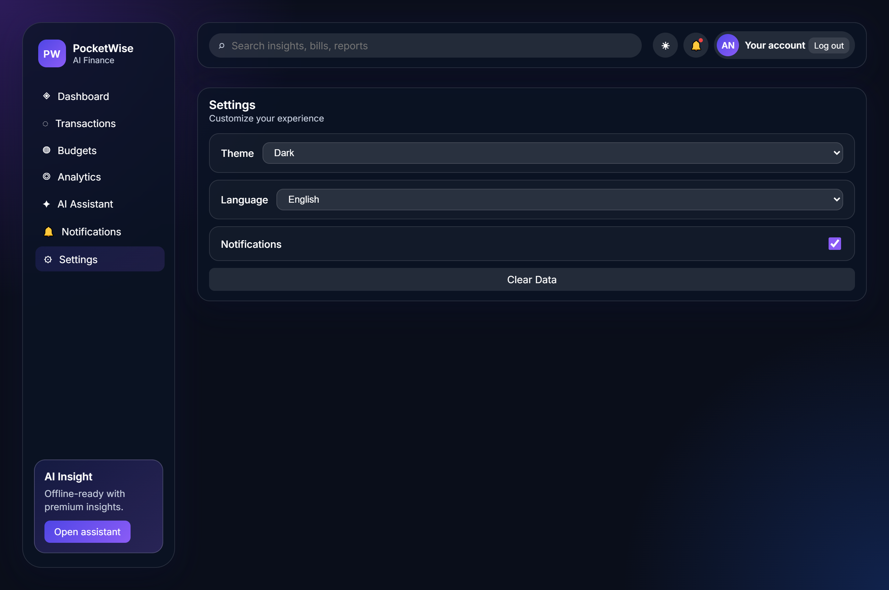

# 💳 PocketWise | AI Personal Finance & Expense Intelligence Dashboard

<div align="center">

# 💜 PocketWise Premium
### AI-Powered Personal Finance Platform

> **Your Money, Simplified.** Track income, expenses, bills, savings goals, and budgets effortlessly with artificial intelligence and an ultra-modern glassmorphic dashboard.

<p align="center">
  <a href="https://pocketwise.ox0x.com">
    
  </a>
  <a href="https://github.com/megazone272/PocketWise">
    
  </a>
  
  
  
</p>

<br/>


</div>

---

## 🌟 Overview

**PocketWise** is an advanced, progressive web application (PWA) designed for modern personal finance tracking, intelligent budgeting, and AI-driven financial advice. Powered by Google Gemini AI & Groq API, Chart.js, Firebase, and Vanilla CSS Glassmorphism visual architecture, PocketWise delivers a premium experience on mobile, tablet, and desktop screens.

---

## 📸 Screenshots & Interface Gallery

<div align="center">

### 🌙 Dark & ☀️ Light Theme Modes
<table>
  <tr>
    <td width="50%" align="center"><b>Dark Mode Dashboard</b></td>
    <td width="50%" align="center"><b>Light Mode Dashboard</b></td>
  </tr>
  <tr>
    <td></td>
    <td></td>
  </tr>
</table>

### 💳 Transactions Ledger & AI Receipt Scanner
<table>
  <tr>
    <td width="50%" align="center"><b>Transactions List & Smart Search</b></td>
    <td width="50%" align="center"><b>Add Transaction & AI Scanner Modal</b></td>
  </tr>
  <tr>
    <td></td>
    <td></td>
  </tr>
</table>

### 🎯 Budget Planner & 📈 Financial Analytics
<table>
  <tr>
    <td width="50%" align="center"><b>Monthly Budget Tracker & Goals</b></td>
    <td width="50%" align="center"><b>Interactive Financial Trends & Charts</b></td>
  </tr>
  <tr>
    <td></td>
    <td></td>
  </tr>
</table>

### 🤖 Gemini AI Assistant & 📅 Bills & Notifications Calendar
<table>
  <tr>
    <td width="50%" align="center"><b>AI Financial Assistant Chatbot</b></td>
    <td width="50%" align="center"><b>Bills Calendar & Notifications</b></td>
  </tr>
  <tr>
    <td></td>
    <td></td>
  </tr>
</table>

### ⚙️ Settings Panel & 📱 Mobile Interface
<table>
  <tr>
    <td width="50%" align="center"><b>Settings & Preferences</b></td>
    <td width="50%" align="center"><b>Mobile Responsive View</b></td>
  </tr>
  <tr>
    <td></td>
    <td></td>
  </tr>
</table>

### 🔐 Authentication Screen
<p align="center">
  
</p>

</div>

---

## ✨ Features

### 🤖 AI Financial Assistant & Insights
- **Powered by Gemini & Groq AI**: Real-time conversational financial assistant.
- **Spending Behavior Analysis**: Deep-dive spending pattern analysis.
- **Budget Recommendations & Saving Tips**: Personal recommendations based on real transaction history.
- **Contextual Responses**: Custom tailored financial advice and situational tips.
- **Voice Commands**: Tap-to-speak voice input for hands-free interactions.

### 💳 Managing Transactions & Budgets
- **Full CRUD Support**: Add, modify, verify, search, filter, and delete transactions easily.
- **Categories Management**: Organize income and expenses into customizable categories.
- **Recurring Transactions**: Track monthly, weekly, or annually recurring expenses automatically.
- **AI Receipt OCR Scanner**: Instantly extract merchant, total, and items from uploaded receipt photos.
- **Data Export & Import**: Backup/restore in JSON or export clean CSV files & PDF reports.

### 📊 Smart Dashboard
- **Financial Health Score (0-100)**: Visual indicators evaluating cash flow health.
- **Income & Expense Breakdown**: High-level spending exploration with Chart.js visualizations.
- **Cash Flow Overview**: Live metrics for Total Balance, Monthly Net Savings, and trend lines.
- **Activity Feed**: Real-time timeline of recent financial activities.

### 🎯 Savings Goals & 🧾 Bills Manager
- **Goal Progress Tracking**: Set target dates and visually track progress toward savings milestones.
- **Upcoming Bills Reminders**: Track bill due dates, payment status, and upcoming recurring bills.
- **Visual Indicators**: Progress bars, badges, and status colors.

### 🎨 Premium UI & Customization
- **Modern Glassmorphic Design**: Clean cards, translucent elements, vibrant gradients, and smooth micro-interactions.
- **Dark & Light Themes**: Instant toggle with system preference matching.
- **Dual Language & Native RTL Support**: Full support for **English (🇺🇸)** and **Arabic (🇪🇬 العربية)**.
- **Command Palette (`Ctrl / Cmd + K`)**: Quick keyboard shortcuts for navigating sections.
- **Offline PWA Support**: Installable on Android, iOS, Windows, and macOS.

### 🔐 Authentication & Backend Security
- **Firebase Authentication**: Email/Password Sign-In and Google One-Tap Sign-In.
- **Cloud Firestore**: Real-time cloud synchronization with per-user isolated data rules.
- **Persistent Sessions**: Stay logged in across browser sessions securely.

---

## 🛠️ Technology Stack & Development Tools

### Frontend
- **HTML5 & Vanilla CSS3**: Custom design system built with CSS variables and Glassmorphism techniques.
- **JavaScript (ES6+)**: Modular client-side architecture without standard bloated framework overhead.
- **Chart.js 4.4**: Responsive, animated chart visualizations.
- **jsPDF & AutoTable**: Client-side document generation.

### Backend & Cloud Services
- **Node.js**: Server-side REST API runtime.
- **Firebase Auth & Cloud Firestore**: Secure user auth and NoSQL Firestore database.
- **Google Gemini AI & Groq API**: Generative AI language models for intelligence & OCR processing.

---

## 📁 Project Organization

```text
PocketWise/
├── index.html                  # Main application HTML markup
├── style.css                   # Glassmorphic visual CSS framework
├── script.js                   # Application state & UI router logic
├── server.js                   # Node.js backend server (API & AI proxy)
├── firebase.js                 # Firebase initialization & auth methods
├── settings.js                 # App preferences & theme manager
├── transactions.js             # Financial transaction engine
├── translations.js             # i18n dictionaries (English & Arabic)
├── chart.js                    # Chart.js initialization & data binders
├── calendar.js                 # Interactive calendar module
├── sw.js                       # Progressive Web App Service Worker
├── manifest.webmanifest        # PWA metadata configuration
├── firestore.rules             # Firestore security rules
├── package.json                # Project dependencies & scripts
├── .env.example                # Sample environment configuration
├── screenshots/                # Showcase screenshot images
│   ├── 01_auth_page.png
│   ├── 02_dashboard_dark.png
│   ├── 03_transactions.png
│   ├── 04_add_transaction_modal.png
│   ├── 05_budgets.png
│   ├── 06_analytics.png
│   ├── 07_ai_assistant.png
│   ├── 08_notifications_calendar.png
│   ├── 09_settings.png
│   ├── 10_dashboard_light.png
│   └── 11_mobile_view.png
└── README.md                   # Documentation file
```

---

## 📲 Deployment & Local Setup

### 1. Clone the Repository
```bash
git clone https://github.com/megazone272/PocketWise.git
cd PocketWise
```

### 2. Install Dependencies
```bash
npm install
```

### 3. Configure Environment Variables
Copy `.env.example` to `.env` and fill in your Firebase and Groq / Gemini API credentials:
```bash
cp .env.example .env
```

### 4. Start the Application
```bash
npm start
```

Open your browser and navigate to:
```text
http://localhost:3007
```

---

## 🌍 Supported Languages
- 🇺🇸 **English**
- 🇪🇬 **العربية (Arabic)** - Full RTL Support

---

## 🔒 Security Techniques
- **Firebase Auth Tokens** for user validation.
- **Firestore Security Rules** restricting document access per User ID (`request.auth.uid == userId`).
- **Input Sanitization & Validation** to prevent XSS attacks.
- **Encrypted REST API** proxy for private API key handling.

---

## 📈 Future Plans & Roadmap
- [ ] 📷 AI-based Receipt Scanner with enhanced multi-item OCR parsing
- [ ] 🎙️ Voice Assistant for hands-free voice expense logging
- [ ] 📊 Monthly Financial Health PDF Reports generator
- [ ] 💡 AI Smart Reminders for bill payments & subscription renewals
- [ ] 💱 Multi-currency Converter & live exchange rates
- [ ] 📱 Native Mobile App wrappers (Capacitor / React Native)

---

## 🤝 Contributing

Contributions are always welcome! 
1. **Fork** the repository.
2. Create your feature branch (`git checkout -b feature/AmazingFeature`).
3. **Commit** your changes (`git commit -m 'Add some AmazingFeature'`).
4. **Push** to the branch (`git push origin feature/AmazingFeature`).
5. Open a **Pull Request**.

---

## 👨‍💻 Author

**Nour Ahmed**
- GitHub: [@megazone272](https://github.com/megazone272)
- Repository: [megazone272/PocketWise](https://github.com/megazone272/PocketWise)

---

## ⭐ Support

If you find **PocketWise** helpful, please give the repository a **⭐ Star** on GitHub! Your support helps expand feature development and maintenance.

<div align="center">

### 💜 PocketWise
*Make smarter financial decisions powered by AI, modern web tech, and Firebase.*

</div>
